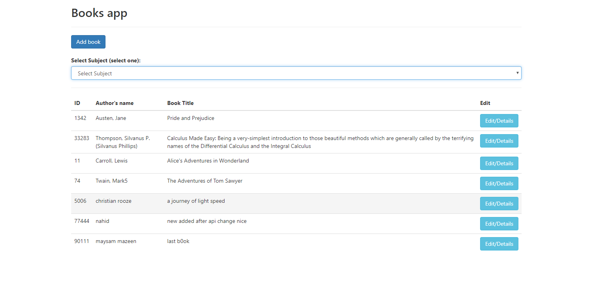
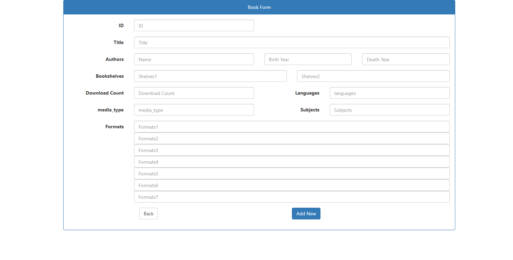
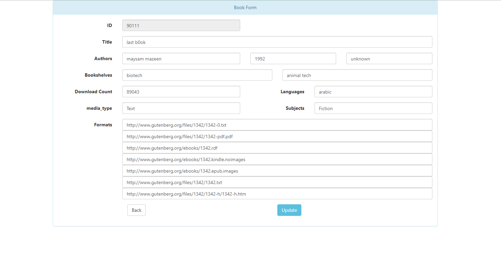

This project was bootstrapped with [Create React App](https://github.com/facebook/create-react-app).

## Available Scripts

In the project directory,First you need to install dependencies by

### `yarn install`

then enter api folder inside main directory `uptain-book-app/api` then run
### `npm start for api run` 
Open [http://localhost:3010/books]

Then again go back to main folder and run the react frontend by

### `yarn start`

Runs the app in the development mode. 
Open [http://localhost:3000](http://localhost:3000) to view it in the browser.

The page will reload if you make edits. 
You will also see any lint errors in the console.

Please see the `screenshot` to see the view

